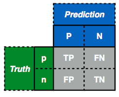

Performance measures
====================

Different performance measures for evaluating whether your model is good or not.

# Classification

Build confusion matrix and calculate accuracy, precision, and recall.

* Precision (first column) = TP / (TP + FP)
* Recall (first row) = TP / (TP + FN)
* Accuracy = (TP + TN) / (TP + FP + FN + TN)

In R:

~~~~{.r}
conf <- table(real, predicted)

TP <- conf[1, 1]
FN <- conf[1, 2]
FP <- conf[2, 1]
TN <- conf[2, 2]

accuracy  <- (TP + TN) / (TP + FN + FP + TN)
# or
accuracy  <- sum(diag(conf)) / sum(conf)
precision <- TP / (TP + FP)
recall    <- TP / (TP + FN)
~~~~

# Regression

Root Mean Squared Error (RMSE), which is the mean distance between estimates and the regression line.

$$ RMSE = \sqrt{ \frac{1}{N} \sum_{i=1}^{N} (y_i - \hat{y}_i)^2 } $$

In R:

~~~~{.r}
rmse <- sqrt( ( 1/length(pred) ) * sum( (real - pred) ^ 2) )
~~~~

# Clustering

Measure the distance between points within a cluster and between clusters.

* Within Sum of Squares (WSS) measures the within cluster similarity
* Between cluster Sum of Squares (BSS) measures the between cluster similarity
* Dunn's index is the minimal intercluster distance (between cluster measurement) divided by the maximal diameter (within cluster measurement)

For K-means clustering, the measures for WSS and BSS can be found in the cluster object as tot.withinss and betweenss.

~~~~{.r}
km <- kmeans(data, 3)

names(km)
[1] "cluster"      "centers"      "totss"        "withinss"     "tot.withinss"
[6] "betweenss"    "size"         "iter"         "ifault" 
~~~~

# Cross validation

# Receiver Operator Characteristic Curve

* The false positive rate (second row), FP / (FP + TN), is on the x-axis
* The true positive rate (recall or first row), TP / (TP + FN), is on the y-axis
* Use the R package called ROCR

~~~~{.r}
# split iris dataset into training and test
set.seed(31)
x     <- sample(1:nrow(iris), size = 0.8 * nrow(iris), replace = FALSE)
x_hat <- setdiff(1:150, x)
train <- iris[x,]
test  <- iris[x_hat,]

library(rpart)
tree <- rpart(Species ~ ., train, method = "class")

probs <- predict(tree, test, type = "prob")
probs_setosa <- probs[,1]
probs_versicolor <- probs[,2]

library(ROCR)
setosa <- as.numeric(grepl(pattern = 'setosa', x = test$Species))
versicolor <- as.numeric(grepl(pattern = 'versicolor', x = test$Species))
pred <- prediction(probs_setosa, setosa)
pred <- prediction(probs_versicolor, versicolor)

auc <- performance(pred, 'auc')
auc_value <- auc@y.values[[1]]

perf <- performance(pred, 'tpr', 'fpr')
plot(perf, main='ROC for versicolor')
legend('bottomright', legend = paste('AUC = ', auc_value))
~~~~

