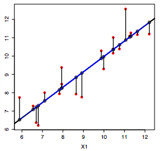

Performance measures
====================

Different performance measures for evaluating whether your model is good or not.

# Classification

Build confusion matrix and calculate accuracy, precision, and recall.

* Precision (first column) = TP / (TP + FP)
* Recall (first row) = TP / (TP + FN)
* Accuracy = (TP + TN) / (TP + FP + FN + TN)

In R:

~~~~{.r}
conf <- table(real, predicted)

TP <- conf[1, 1]
FN <- conf[1, 2]
FP <- conf[2, 1]
TN <- conf[2, 2]

accuracy  <- (TP + TN) / (TP + FN + FP + TN)
# or
accuracy  <- sum(diag(conf)) / sum(conf)
precision <- TP / (TP + FP)
recall    <- TP / (TP + FN)
~~~~

# Regression

Root Mean Squared Error (RMSE), which is the mean distance between estimates and the regression line.

$$ RMSE = \sqrt{ \frac{1}{N} \sum_{i=1}^{N} (y_i - \hat{y}_i)^2 } $$

In R:

~~~~{.r}
rmse <- sqrt( ( 1/length(pred) ) * sum( (real - pred) ^ 2) )
~~~~

# Clustering

Measure the distance between points within a cluster and between clusters.

* Within Sum of Squares (WSS) measures the within cluster similarity
* Between cluster Sum of Squares (BSS) measures the between cluster similarity
* The [Dunn index](https://en.wikipedia.org/wiki/Dunn_index) is the minimal intercluster distance (between cluster measurement) divided by the maximal diameter (within cluster measurement); a higher Dunn index indicates better clustering

For K-means clustering, the measures for WSS and BSS can be found in the cluster object as tot.withinss and betweenss.

~~~~{.r}
km <- kmeans(iris[,-5], centers = 3, nstart = 1)

km
K-means clustering with 3 clusters of sizes 62, 50, 38

Cluster means:
  Sepal.Length Sepal.Width Petal.Length Petal.Width
1     5.901613    2.748387     4.393548    1.433871
2     5.006000    3.428000     1.462000    0.246000
3     6.850000    3.073684     5.742105    2.071053

Clustering vector:
  [1] 2 2 2 2 2 2 2 2 2 2 2 2 2 2 2 2 2 2 2 2 2 2 2 2 2 2 2 2 2 2 2 2 2 2 2 2 2
 [38] 2 2 2 2 2 2 2 2 2 2 2 2 2 1 1 3 1 1 1 1 1 1 1 1 1 1 1 1 1 1 1 1 1 1 1 1 1
 [75] 1 1 1 3 1 1 1 1 1 1 1 1 1 1 1 1 1 1 1 1 1 1 1 1 1 1 3 1 3 3 3 3 1 3 3 3 3
[112] 3 3 1 1 3 3 3 3 1 3 1 3 1 3 3 1 1 3 3 3 3 3 1 3 3 3 3 1 3 3 3 1 3 3 3 1 3
[149] 3 1

Within cluster sum of squares by cluster:
[1] 39.82097 15.15100 23.87947
 (between_SS / total_SS =  88.4 %)

Available components:

[1] "cluster"      "centers"      "totss"        "withinss"     "tot.withinss"
[6] "betweenss"    "size"         "iter"         "ifault"

# install.packages('clValid')
library(clValid)
d  <- dist(iris[,-5])
dunn(d, km$cluster)
[1] 0.09880739

# my expanded example from clValid
express <- mouse[1:25, -c(1,8)]
rownames(express) <- mouse$ID[1:25]
express_dist <- dist(express,method="euclidean")
express_hclust <- hclust(express_dist, method="average")
express_cluster <- cutree(express_hclust, k = 3)
dunn(Dist, express_cluster)
[1] 0.2315126

# install.packages('dendextend')
library(dendextend)
plot(color_branches(express_hclust, k = 3))
~~~~

# Cross validation

# Receiver Operator Characteristic Curve

* The false positive rate (second row of confusion matrix), FP / (FP + TN), is on the x-axis
* The true positive rate (recall or first row of confusion matrix), TP / (TP + FN), is on the y-axis
* Use the R package called ROCR

~~~~{.r}
# split iris dataset into training and test
set.seed(31)
x     <- sample(1:nrow(iris), size = 0.8 * nrow(iris), replace = FALSE)
x_hat <- setdiff(1:150, x)
train <- iris[x,]
test  <- iris[x_hat,]

library(rpart)
tree <- rpart(Species ~ ., train, method = "class")

probs <- predict(tree, test, type = "prob")
probs_setosa <- probs[,1]
probs_versicolor <- probs[,2]

library(ROCR)
setosa <- as.numeric(grepl(pattern = 'setosa', x = test$Species))
versicolor <- as.numeric(grepl(pattern = 'versicolor', x = test$Species))
pred <- prediction(probs_setosa, setosa)
pred <- prediction(probs_versicolor, versicolor)

auc <- performance(pred, 'auc')
auc_value <- auc@y.values[[1]]

perf <- performance(pred, 'tpr', 'fpr')
plot(perf, main='ROC for versicolor')
legend('bottomright', legend = paste('AUC = ', auc_value))
~~~~

